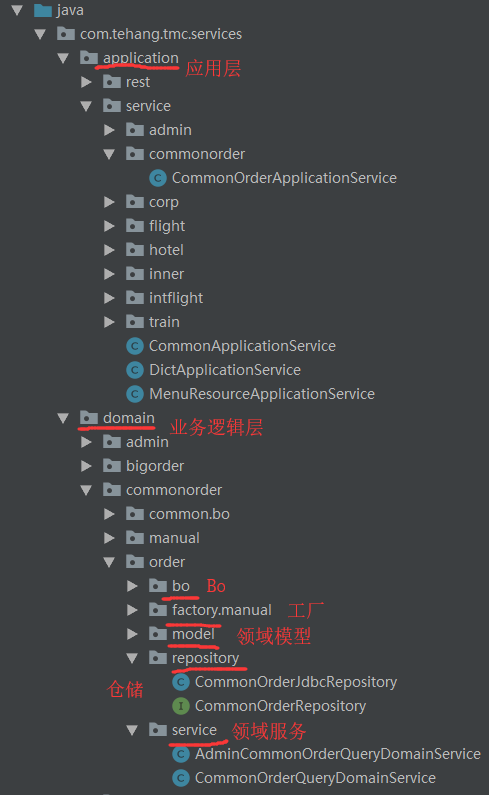
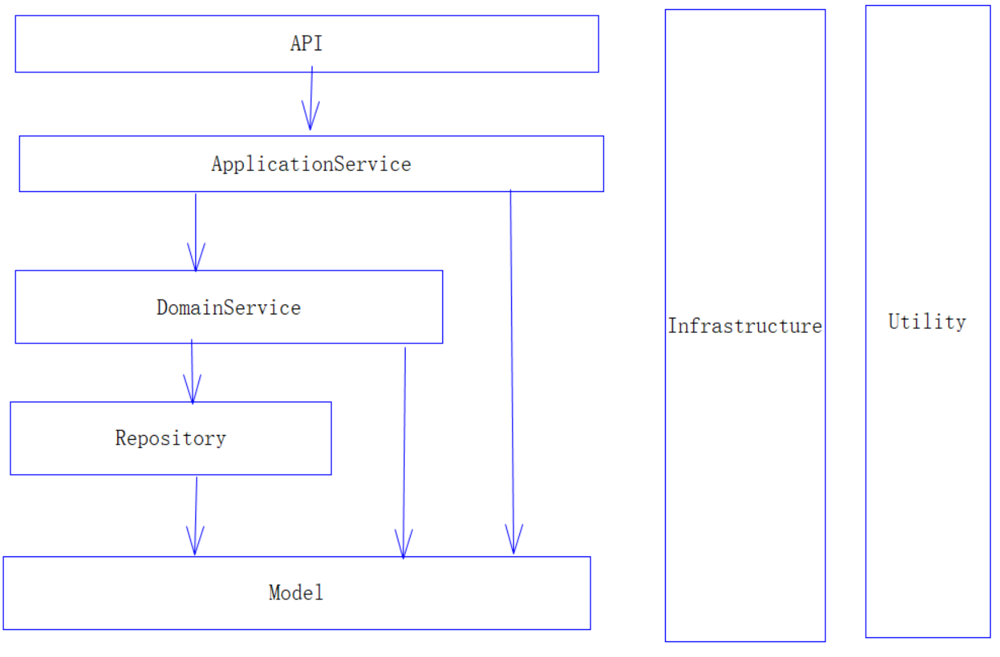

# Java后台服务分层规范

## 0. 分层概述

好的层次划分可以使代码结构清楚，项目分工明确，可读性大大提升，更加有利于后期的维护和升级。  
本规范借鉴了领域模型的分层方式，其中领域层是整个系统的核心层。

## 1. 分层示例：

其中各层的引用关系从上到下依次为：  
API层 -> Application层 -> DomainService -> Repository -> DomainModel

引用关系见下图

## 2. API层

API层用来定义对外的接口，对应于SpringMVC的Controller。  
在API层定义接口格式（比如Swagger的各种标记)，也可以进行参数验证（比如使用@Validated)。  
在API层实现登录及权限验证。  
API层应该是很薄的一层，仅仅是参数验证，然后转发到Application层。

## 3. 应用层(Application层)

应用层的每个方法定义软件要完成的一项任务；  
应用层不包含具体的业务逻辑处理，而是协调业务逻辑层的类来完成任务；  
API返回代码应该在应用层进行定义。

## 4. 领域层(Domain层)

领域层负责表达业务逻辑，是整个系统的核心层。  
领域层的类根据职责不同，又划分为以下几部分：DomainModel, DomainService, Repository, ServiceProxy, Bo。

### 4.1 领域模型(DomainModel)

- 领域模型应该是充血模型, 对DomainModel状态的修改应通过调用DomainModel的方法进行。  
- 领域模型参照DDD中的聚合，实体，值对象的概念进行划分，对DomainModel的任何修改都应该通过聚合根进行。
- 领域模型的创建属于领域层的职责，应该在领域层添加相应的工厂类（对于简单的实体，也可以直接在类中定义一个静态的create方法）。
- 领域模型中聚合根应该由自身来维护状态的完整性。
- 领域模型不应该暴露在应用层之外，应该通过Bo(领域层的数据传输对象)来与领域层外部交互。

### 4.2 领域服务(DomainService)

- 一个领域服务应该只有一个公有方法，用来完成一个独立的业务操作。
- 领域服务用来协调一个或多个聚合，对聚合的更改应委托聚合自身来完成。
- 对于复杂的业务，领域服务允许包含另外的领域服务。

### 4.3 仓储(Repository)

仓储根据职责分成两类：修改和查询(create，update和delete都归类为修改)。  
这两类仓储可以采用不同的实现方式，比如修改采用Spring data JPA(Hibernate)，而查询可以直接采用JdbcTemplate。

### 4.4 外部服务代理(ServiceProxy)

对外部服务的调用应封装在单独的类中。也可以封装出外部服务的接口，调用者只注入接口即可，外部服务的实现类在运行时由Spring注入。

### 4.5 Bo(领域层的数据传输对象)

对于领域层操作所需要的参数，或者领域层返回外部的数据，应该定义Bo对象，以避免暴露领域模型到外部。  
Bo对象只应该包含简单的数据字段和一些验证方法，也可以包含从领域模型到Bo对象的转换方法。

## 5. 基础设施层(infrastructure层)

基础设施层包含一些通用逻辑，如系统配置，常量定义，日志处理，缓存等，以及一些第三方组件的封装。

## 6. utility层

utility层包含一些共用的辅助方法。

## 7. 最佳实践

- 对于比较复杂的项目，每个分层中可以根据模块再分成多个目录，以方便管理。
- 事务应该在ApplicationService或DomainService中定义，具体位置根据情况决定。
- 事务范围应尽量短，事务中不应包括远程服务调用及消息收发操作。
- 关于消息的发送应遵守以下约定：
  - 消息发送应该封装成独立的类，类名类似于xxxMessageProducer, 类定义放在DomainService目录下。
  - xxxMessageProducer类似DomainService，可以由其他的DomainService或ApplicationService调用。

- 关于消息接收应遵守以下约定：
  - 消息接收的类应定义在Infrastructure层中，命名类似于xxxMessageConsumer;
  - xxxMessageConsumer调用ApplicationService来完成实际处理。
  - xxxMessageConsumer类似xxxController，都是由外部调用发起。